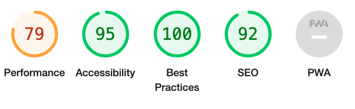
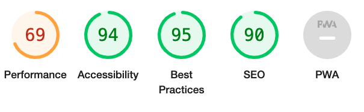
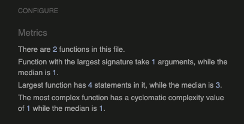
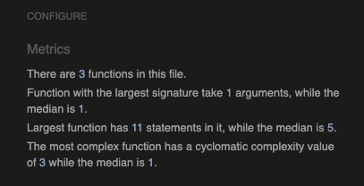
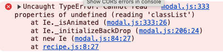
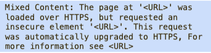

Back to the [README](README.md)

Testing was an ongoing process during the project's development, with each view undergoing frequent evaluation. Whenever results deviated from expectations, immediate debugging efforts were undertaken.

### Python Validation - PEP8
Python testing was done using the [Code Institute's PEP8](https://pep8ci.herokuapp.com/) to ensure there were no syntax errors in the project. All python files were entered into the online checker and no errors were found in any of the custom codes.

### Lighthouse
Result Mobile

Result Desktop

### HTML Validation
[W3C](https://validator.w3.org/) were used to validate html. The HTML code I have written passed the W3C markup validation. The errors that occurred with my own code have been resolved.

**Issues with Summernote in Recipe Forms**
While validating the Add Recipe and Edit Recipe forms, I encountered several issues stemming from the Summernote library that activates upon using these forms. Since these errors originated from the Summernote library rather than my own code, I was unable to resolve them, leaving the issues unaddressed.

Solve bug with footer shrinking too much on add recipe and update recipe pages by adding code to settings.py, found at [Stack Overflow](https://stackoverflow.com/questions/61657061/how-do-i-resize-the-width-of-summernote/74774242#74774242)

### CSS Validation
No errors were found when using [W3C Jigsaw validation](https://jigsaw.w3.org/css-validator/) for the custom CSS.

### JavaScript Validation
No errors were found when using [JS Hint](https://jshint.com/) for the Javascript, when adding /* jshint esversion: 6 */ /* globals bootstrap */ in top of the code in JS Hint.

recipe.js

comment.js

### Console Results
The browser console shows one error. The error does not seem to affect any functions and does not show in any linter tool.

Solved through https://github.com/twbs/bootstrap/issues/37305

### Browser Testing
The Website was tested on Google Chrome, Firefox, Safari browsers with no issues noted.

### Manual Testing
[User Acceptance Testing and Functional Testing](manual_testing.md)

### Remaining Bugs
- If a user attempts to rate their own recipe, an error message appears, but the entered rating number persists in the field even after reloading the page.

- When a comment is submitted and the page is refreshed, another identical comment is submitted.

- There is an unnecessary field created in the add and update form for the current image, even though information about the current image is provided below.

### Fixed Bugs
Received a warning message in the devtools console. Solved it by adding <meta http-equiv="Content-Security-Policy" content="upgrade-insecure-requests"> to base.html

